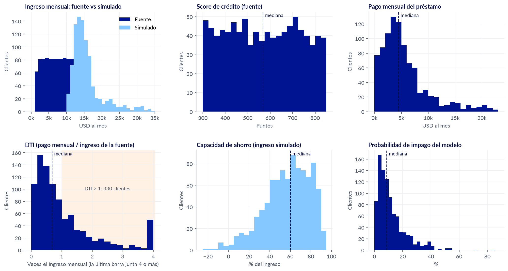
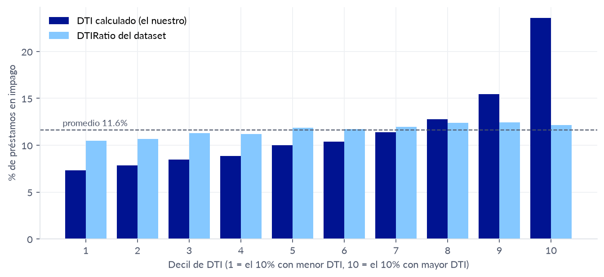
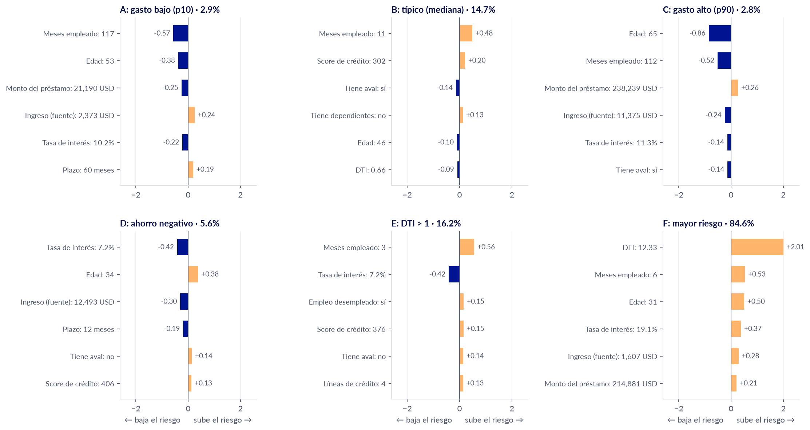

# Fase 5 — Revisión de distribuciones y casos representativos

Nuestro líder mentor Eduardo (BBVA) pidió revisar las distribuciones de las variables y algunos
casos representativos antes de cerrar la parte de ingreso, score, DTI y
modelo de impago. Este documento junta esa revisión.

Datos: corrida del DAG `bronze_ingest` de octubre de 2026, 924 clientes con
préstamo asignado (Opción A). Montos en USD. Las gráficas se generan con
`src/reportes/revision_distribuciones.py` (ver el final).

## 1. Distribución de las variables



| Variable                         | Mín    | p10    | Mediana | p90    | Máx    |
| -------------------------------- | ------ | ------ | ------- | ------ | ------ |
| `ingreso_mensual_fuente` (USD)   | 1,256  | 2,377  | 6,872   | 11,371 | 12,493 |
| `ingreso_mensual_simulado` (USD) | 10,244 | 11,933 | 14,559  | 22,206 | 34,599 |
| `score_credito_fuente`           | 300    | 350    | 568     | 791    | 849    |
| `pago_mensual_prestamo` (USD)    | 183    | 1,242  | 4,452   | 11,657 | 23,060 |
| `ratio_endeudamiento` (DTI)      | 0.02   | 0.18   | 0.68    | 2.49   | 14.00  |
| `capacidad_ahorro`               | −22%   | 27%    | 60%     | 84%    | 94%    |
| `prob_impago`                    | 0.6%   | 2.7%   | 8.7%    | 25.9%  | 84.6%  |

Lo que se ve:

- **Los dos ingresos casi no se enciman.** El de la fuente va de 1,256 a
  12,493 USD/mes y el simulado de 10,244 a 34,599. Por eso se usan por
  separado: el simulado para ahorro y flujo, el de la fuente para DTI y el
  modelo (decisión 2 de `docs/fase4_decisiones_kpis.md`).
- **El score de la fuente es casi plano** de 300 a 849: el dataset es
  sintético y lo genera parejo, no con la forma de campana de un buró
  real. Esto explica que pese poco en el modelo.
- **El pago mensual y el DTI tienen cola larga.** La mitad de los clientes
  tiene un DTI menor a 0.68, pero 330 (36%) pasan de 1 y 135 pasan de 2,
  porque el dataset genera montos de préstamo sin relación con el ingreso.
  No se recortan (ver decisión 3).
- **Capacidad de ahorro:** mediana de 60%; 14 clientes quedan en negativo
  (gastan más que su ingreso simulado).
- **Probabilidad de impago:** concentrada abajo. Mediana de 8.7% y el 90%
  de los clientes está por debajo de 26%; 8 clientes pasan de 50%.

## 2. ¿El DTI calculado separa el riesgo?

Tasa de impago real de los 255,347 préstamos de Loan Default, ordenados por
DTI y partidos en 10 grupos del mismo tamaño:



| Decil de DTI               | 1     | 2     | 3     | 4     | 5     | 6     | 7     | 8     | 9     | 10    |
| -------------------------- | ----- | ----- | ----- | ----- | ----- | ----- | ----- | ----- | ----- | ----- |
| DTI calculado (el nuestro) | 7.3%  | 7.9%  | 8.5%  | 8.9%  | 10.0% | 10.4% | 11.4% | 12.8% | 15.5% | 23.6% |
| `DTIRatio` del dataset     | 10.5% | 10.7% | 11.3% | 11.2% | 11.9% | 11.7% | 12.0% | 12.4% | 12.5% | 12.2% |

Con nuestro DTI el impago sube de forma constante, de 7.3% a 23.6%. Con el
`DTIRatio` que trae el dataset casi no cambia (10.5% a 12.5%). Esto
confirma la decisión 3: calcular el DTI con la fórmula documentada en vez
de usar el del dataset.

## 3. Casos representativos

Los mismos cinco casos de `docs/fase4_decisiones_kpis.md`, más el cliente
con el riesgo más alto:

|                                 | A: gasto bajo (p10)   | B: típico (mediana)    | C: gasto alto (p90)    | D: ahorro negativo   | E: DTI > 1            | F: mayor riesgo        |
| ------------------------------- | --------------------- | ---------------------- | ---------------------- | -------------------- | --------------------- | ---------------------- |
| Gasto mensual real              | 2,246                 | 6,188                  | 11,847                 | 21,956               | 4,115                 | 1,837                  |
| Capacidad de ahorro             | 82%                   | 56%                    | 12%                    | −22%                 | 63%                   | 88%                    |
| Ingreso de la fuente            | 2,373                 | 6,878                  | 11,375                 | 12,493               | 4,439                 | 1,607                  |
| Préstamo (monto / tasa / plazo) | 21,190 / 10.2% / 60 m | 134,850 / 12.8% / 36 m | 238,239 / 11.4% / 36 m | 95,111 / 7.2% / 12 m | 175,940 / 7.3% / 24 m | 214,881 / 19.1% / 12 m |
| DTI                             | 0.19                  | 0.66                   | 0.69                   | 0.66                 | 1.78                  | 12.33                  |
| Score de la fuente              | 318                   | 302                    | 424                    | 406                  | 376                   | 310                    |
| Edad / meses empleado           | 53 / 117              | 46 / 11                | 65 / 112               | 34 / 47              | 46 / 3                | 31 / 6                 |
| **`prob_impago`**               | **2.9%**              | **14.7%**              | **2.8%**               | **5.6%**             | **16.2%**             | **84.6%**              |

### Por qué el modelo le da esa probabilidad a cada uno

Como el modelo es una regresión logística, su probabilidad se puede
desarmar en el aporte de cada variable (`src/ml/explicacion.py`). El aporte
dice cuánto sube (positivo) o baja (negativo) el riesgo de ese cliente
frente a un préstamo promedio del dataset. Estas son las seis variables que
más pesan en cada caso:



- **A (2.9%):** casi 10 años en su empleo y 53 años de edad bajan mucho el
  riesgo, y el préstamo es chico. Su ingreso bajo lo sube un poco.
- **B (14.7%):** solo 11 meses en su empleo y score de 302 lo ponen arriba
  del promedio (11.6%), aunque tiene aval.
- **C (2.8%):** 65 años y 112 meses empleado compensan que su préstamo sea
  de los más grandes (238 mil USD).
- **D (5.6%):** tasa baja (7.2%), plazo corto e ingreso alto. Su ahorro es
  negativo, pero el modelo no ve el ahorro: son dos lecturas distintas del
  cliente, como se decidió (ver `docs/fase5_modelo_impago.md`).
- **E (16.2%):** lo que más pesa no es su DTI sino que lleva 3 meses
  empleado y está desempleado. Su DTI de 1.78 aporta poco (+0.11) porque en
  este dataset el DTI promedio de los préstamos ya es 1.16, con mucha
  variación (desviación de 1.47), así que 1.78 no se sale de lo normal.
- **F (84.6%):** aquí el DTI sí domina (+2.01): su pago mensual es 12 veces
  su ingreso. Se suman poca antigüedad laboral, 31 años y una tasa de 19%.

La suma de los aportes reproduce exactamente la `prob_impago` del modelo
(diferencia máxima de 0.0001), y hay una prueba automática que lo verifica
(`tests/ml/test_modelo_impago.py`).

## 4. Propuesta: niveles de riesgo

Para el dashboard ejecutivo hace falta agrupar la probabilidad en niveles.
Se proponen cortes redondos en 10% y 30%:

| Nivel             | Clientes | % de clientes | Préstamos del dataset en ese nivel | Impago real de esos préstamos |
| ----------------- | -------- | ------------- | ---------------------------------- | ----------------------------- |
| Bajo (< 10%)      | 519      | 56%           | 147,479                            | 5.2%                          |
| Medio (10% – 30%) | 340      | 37%           | 91,495                             | 16.8%                         |
| Alto (≥ 30%)      | 65       | 7%            | 16,373                             | 40.8%                         |

Los niveles separan bien el riesgo real: en los préstamos de nivel alto
cayó en impago el 40.8%, casi 8 veces más que en el nivel bajo. El impago
real se midió sobre los 255,347 préstamos del dataset; el 80% se usó para
entrenar, pero el modelo da casi el mismo AUC en entrenamiento y en prueba
(0.753 y 0.749), así que no está inflado.

## 5. Para decidir con Líder Eduardo

1. ¿Con esta revisión se da por cerrada la parte de ingreso, score y DTI?
2. ¿Están bien los cortes de 10% y 30%, o BBVA maneja otros?
3. ¿Este nivel de explicación por cliente es suficiente? ¿Lo mostramos en
   el dashboard ejecutivo?

## Cómo regenerar las gráficas

Después de correr el DAG completo (el paso `modelo_prob_impago` guarda en
`data/gold/modelo_impago_metricas.json` el intercepto y la media y
desviación de cada variable, que se usan para explicar los casos):

```
pip install pandas pyarrow matplotlib
python -m src.reportes.revision_distribuciones
```

Escribe las imágenes en `docs/img/revision/` e imprime las tablas de este
documento. Usa los colores de la Guía de Estilo de BBVA y la fuente Lato si
está instalada.
